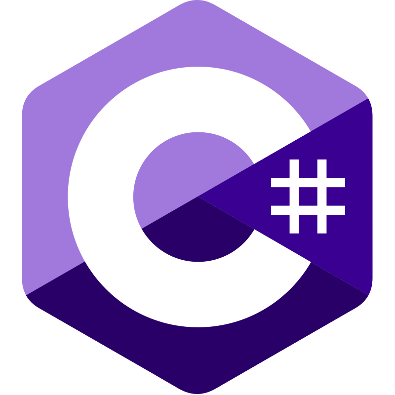

# Advent of Code

My solutions to [Advent of Code](https://adventofcode.com) puzzles, written in a different language every year.

**374 / 374 stars** across 8 years and 8 languages. Every solution is covered by tests against the puzzle examples and my own input.

| Year | Language | Stars | Tests |
| :---: | --- | :---: | --- |
| [2018](./2018) |  Go | 50 ⭐ |  |
| [2019](./2019) |  Java | 50 ⭐ |  |
| [2020](./2020) |  Kotlin | 50 ⭐ |  |
| [2021](./2021) |  Python | 50 ⭐ |  |
| [2022](./2022) |  TypeScript | 50 ⭐ |  |
| [2023](./2023) |  JavaScript | 50 ⭐ |  |
| [2024](./2024) |  C# | 50 ⭐ |  |
| [2025](./2025) |  Elixir | 24 ⭐ |  |

## Running the tests

Each year is a self-contained project. Every day has two kinds of tests:

- **Example tests** run the samples from the puzzle description. They are fast, and CI runs only these.
- **Solution tests** run my full puzzle input. Some of them take a while.

From inside a year's folder, run all tests with the project's usual test command, or only the example tests with:

| Year | Example tests only |
| :---: | --- |
| 2018 | `go test ./... -run //Example` |
| 2019 | `mvn test -Dtest='*Test*#testExample*'` |
| 2020 | `./gradlew test --tests '*example*'` |
| 2021 | `cd tests && PYTHONPATH=.. python -m pytest -k example` |
| 2022 | `npx jest -t example` |
| 2023 | `npx jest -t example` |
| 2024 | `dotnet test --filter 'Name~Example'` |
| 2025 | `mix test --only test:'test part1 example' --only test:'test part2 example'` |

## Puzzles

<b>2018</b> · Go · 50 ⭐

<table>
  <tr>
    <td>
      <b>Day 1</b> 
      <a href="https://adventofcode.com/2018/day/1">Chronal Calibration</a> 
      ⭐⭐
    </td>
    <td>
      <b>Day 2</b> 
      <a href="https://adventofcode.com/2018/day/2">Inventory Management System</a> 
      ⭐⭐
    </td>
    <td>
      <b>Day 3</b> 
      <a href="https://adventofcode.com/2018/day/3">No Matter How You Slice It</a> 
      ⭐⭐
    </td>
    <td>
      <b>Day 4</b> 
      <a href="https://adventofcode.com/2018/day/4">Repose Record</a> 
      ⭐⭐
    </td>
    <td>
      <b>Day 5</b> 
      <a href="https://adventofcode.com/2018/day/5">Alchemical Reduction</a> 
      ⭐⭐
    </td>
  </tr>
  <tr>
    <td>
      <b>Day 6</b> 
      <a href="https://adventofcode.com/2018/day/6">Chronal Coordinates</a> 
      ⭐⭐
    </td>
    <td>
      <b>Day 7</b> 
      <a href="https://adventofcode.com/2018/day/7">The Sum of Its Parts</a> 
      ⭐⭐
    </td>
    <td>
      <b>Day 8</b> 
      <a href="https://adventofcode.com/2018/day/8">Memory Maneuver</a> 
      ⭐⭐
    </td>
    <td>
      <b>Day 9</b> 
      <a href="https://adventofcode.com/2018/day/9">Marble Mania</a> 
      ⭐⭐
    </td>
    <td>
      <b>Day 10</b> 
      <a href="https://adventofcode.com/2018/day/10">The Stars Align</a> 
      ⭐⭐
    </td>
  </tr>
  <tr>
    <td>
      <b>Day 11</b> 
      <a href="https://adventofcode.com/2018/day/11">Chronal Charge</a> 
      ⭐⭐
    </td>
    <td>
      <b>Day 12</b> 
      <a href="https://adventofcode.com/2018/day/12">Subterranean Sustainability</a> 
      ⭐⭐
    </td>
    <td>
      <b>Day 13</b> 
      <a href="https://adventofcode.com/2018/day/13">Mine Cart Madness</a> 
      ⭐⭐
    </td>
    <td>
      <b>Day 14</b> 
      <a href="https://adventofcode.com/2018/day/14">Chocolate Charts</a> 
      ⭐⭐
    </td>
    <td>
      <b>Day 15</b> 
      <a href="https://adventofcode.com/2018/day/15">Beverage Bandits</a> 
      ⭐⭐
    </td>
  </tr>
  <tr>
    <td>
      <b>Day 16</b> 
      <a href="https://adventofcode.com/2018/day/16">Chronal Classification</a> 
      ⭐⭐
    </td>
    <td>
      <b>Day 17</b> 
      <a href="https://adventofcode.com/2018/day/17">Reservoir Research</a> 
      ⭐⭐
    </td>
    <td>
      <b>Day 18</b> 
      <a href="https://adventofcode.com/2018/day/18">Settlers of The North Pole</a> 
      ⭐⭐
    </td>
    <td>
      <b>Day 19</b> 
      <a href="https://adventofcode.com/2018/day/19">Go With The Flow</a> 
      ⭐⭐
    </td>
    <td>
      <b>Day 20</b> 
      <a href="https://adventofcode.com/2018/day/20">A Regular Map</a> 
      ⭐⭐
    </td>
  </tr>
  <tr>
    <td>
      <b>Day 21</b> 
      <a href="https://adventofcode.com/2018/day/21">Chronal Conversion</a> 
      ⭐⭐
    </td>
    <td>
      <b>Day 22</b> 
      <a href="https://adventofcode.com/2018/day/22">Mode Maze</a> 
      ⭐⭐
    </td>
    <td>
      <b>Day 23</b> 
      <a href="https://adventofcode.com/2018/day/23">Experimental Emergency Teleportation</a> 
      ⭐⭐
    </td>
    <td>
      <b>Day 24</b> 
      <a href="https://adventofcode.com/2018/day/24">Immune System Simulator 20XX</a> 
      ⭐⭐
    </td>
    <td>
      <b>Day 25</b> 
      <a href="https://adventofcode.com/2018/day/25">FourDimensional Adventure</a> 
      ⭐⭐
    </td>
  </tr>
</table>

<b>2019</b> · Java · 50 ⭐

<table style="text-align: center; width: 1200px;">
  <tr>
    <td>
      <b>Day 1</b> 
      <a href="https://adventofcode.com/2019/day/1">The Tyranny of the Rocket Equation</a> 
      ⭐⭐
    </td>
    <td>
      <b>Day 2</b> 
      <a href="https://adventofcode.com/2019/day/2">1202 Program Alarm</a> 
      ⭐⭐
    </td>
    <td>
      <b>Day 3</b> 
      <a href="https://adventofcode.com/2019/day/3">Crossed Wires</a> 
      ⭐⭐
    </td>
    <td>
      <b>Day 4</b> 
      <a href="https://adventofcode.com/2019/day/4">Secure Container</a> 
      ⭐⭐
    </td>
    <td>
      <b>Day 5</b> 
      <a href="https://adventofcode.com/2019/day/5">Sunny with a Chance of Asteroids</a> 
      ⭐⭐
    </td>
  </tr>
  <tr>
    <td>
      <b>Day 6</b> 
      <a href="https://adventofcode.com/2019/day/6">Universal Orbit Map</a> 
      ⭐⭐
    </td>
    <td>
      <b>Day 7</b> 
      <a href="https://adventofcode.com/2019/day/7">Amplification Circuit</a> 
      ⭐⭐
    </td>
    <td>
      <b>Day 8</b> 
      <a href="https://adventofcode.com/2019/day/8">Space Image Format</a> 
      ⭐⭐
    </td>
    <td>
      <b>Day 9</b> 
      <a href="https://adventofcode.com/2019/day/9">Sensor Boost</a> 
      ⭐⭐
    </td>
    <td>
      <b>Day 10</b> 
      <a href="https://adventofcode.com/2019/day/10">Monitoring Station</a> 
      ⭐⭐
    </td>
  </tr>
  <tr>
    <td>
      <b>Day 11</b> 
      <a href="https://adventofcode.com/2019/day/11">Space Police</a> 
      ⭐⭐
    </td>
    <td>
      <b>Day 12</b> 
      <a href="https://adventofcode.com/2019/day/12">The NBody Problem</a> 
      ⭐⭐
    </td>
    <td>
      <b>Day 13</b> 
      <a href="https://adventofcode.com/2019/day/13">Care Package</a> 
      ⭐⭐
    </td>
    <td>
      <b>Day 14</b> 
      <a href="https://adventofcode.com/2019/day/14">Space Stoichiometry</a> 
      ⭐⭐
    </td>
    <td>
      <b>Day 15</b> 
      <a href="https://adventofcode.com/2019/day/15">Oxygen System</a> 
      ⭐⭐
    </td>
  </tr>
  <tr>
    <td>
      <b>Day 16</b> 
      <a href="https://adventofcode.com/2019/day/16">Flawed Frequency Transmission</a> 
      ⭐⭐
    </td>
    <td>
      <b>Day 17</b> 
      <a href="https://adventofcode.com/2019/day/17">Set and Forget</a> 
      ⭐⭐
    </td>
    <td>
      <b>Day 18</b> 
      <a href="https://adventofcode.com/2019/day/18">ManyWorlds Interpretation</a> 
      ⭐⭐
    </td>
    <td>
      <b>Day 19</b> 
      <a href="https://adventofcode.com/2019/day/19">Tractor Beam</a> 
      ⭐⭐
    </td>
    <td>
      <b>Day 20</b> 
      <a href="https://adventofcode.com/2019/day/20">Donut Maze</a> 
      ⭐⭐
    </td>
  </tr>
  <tr>
    <td>
      <b>Day 21</b> 
      <a href="https://adventofcode.com/2019/day/21">Springdroid Adventure</a> 
      ⭐⭐
    </td>
    <td>
      <b>Day 22</b> 
      <a href="https://adventofcode.com/2019/day/22">Slam Shuffle</a> 
      ⭐⭐
    </td>
    <td>
      <b>Day 23</b> 
      <a href="https://adventofcode.com/2019/day/23">Category Six</a> 
      ⭐⭐
    </td>
    <td>
      <b>Day 24</b> 
      <a href="https://adventofcode.com/2019/day/24">Planet of Discord</a> 
      ⭐⭐
    </td>
    <td>
      <b>Day 25</b> 
      <a href="https://adventofcode.com/2019/day/25">Cryostasis</a> 
      ⭐⭐
    </td>
  </tr>
</table>

<b>2020</b> · Kotlin · 50 ⭐

<table style="text-align: center; width: 1200px;">
  <tr>
    <td>
      <b>Day 1</b> 
      <a href="https://adventofcode.com/2020/day/1">Report Repair</a> 
      ⭐⭐
    </td>
    <td>
      <b>Day 2</b> 
      <a href="https://adventofcode.com/2020/day/2">Password Philosophy</a> 
      ⭐⭐
    </td>
    <td>
      <b>Day 3</b> 
      <a href="https://adventofcode.com/2020/day/3">Toboggan Trajectory</a> 
      ⭐⭐
    </td>
    <td>
      <b>Day 4</b> 
      <a href="https://adventofcode.com/2020/day/4">Passport Processing</a> 
      ⭐⭐
    </td>
    <td>
      <b>Day 5</b> 
      <a href="https://adventofcode.com/2020/day/5">Binary Boarding</a> 
      ⭐⭐
    </td>
  </tr>
  <tr>
    <td>
      <b>Day 6</b> 
      <a href="https://adventofcode.com/2020/day/6">Custom Customs</a> 
      ⭐⭐
    </td>
    <td>
      <b>Day 7</b> 
      <a href="https://adventofcode.com/2020/day/7">Handy Haversacks</a> 
      ⭐⭐
    </td>
    <td>
      <b>Day 8</b> 
      <a href="https://adventofcode.com/2020/day/8">Handheld Halting</a> 
      ⭐⭐
    </td>
    <td>
      <b>Day 9</b> 
      <a href="https://adventofcode.com/2020/day/9">Encoding Error</a> 
      ⭐⭐
    </td>
    <td>
      <b>Day 10</b> 
      <a href="https://adventofcode.com/2020/day/10">Adapter Array</a> 
      ⭐⭐
    </td>
  </tr>
  <tr>
    <td>
      <b>Day 11</b> 
      <a href="https://adventofcode.com/2020/day/11">Seating System</a> 
      ⭐⭐
    </td>
    <td>
      <b>Day 12</b> 
      <a href="https://adventofcode.com/2020/day/12">Rain Risk</a> 
      ⭐⭐
    </td>
    <td>
      <b>Day 13</b> 
      <a href="https://adventofcode.com/2020/day/13">Shuttle Search</a> 
      ⭐⭐
    </td>
    <td>
      <b>Day 14</b> 
      <a href="https://adventofcode.com/2020/day/14">Docking Data</a> 
      ⭐⭐
    </td>
    <td>
      <b>Day 15</b> 
      <a href="https://adventofcode.com/2020/day/15">Rambunctious Recitation</a> 
      ⭐⭐
    </td>
  </tr>
  <tr>
    <td>
      <b>Day 16</b> 
      <a href="https://adventofcode.com/2020/day/16">Ticket Translation</a> 
      ⭐⭐
    </td>
    <td>
      <b>Day 17</b> 
      <a href="https://adventofcode.com/2020/day/17">Conway Cubes</a> 
      ⭐⭐
    </td>
    <td>
      <b>Day 18</b> 
      <a href="https://adventofcode.com/2020/day/18">Operation Order</a> 
      ⭐⭐
    </td>
    <td>
      <b>Day 19</b> 
      <a href="https://adventofcode.com/2020/day/19">Monster Messages</a> 
      ⭐⭐
    </td>
    <td>
      <b>Day 20</b> 
      <a href="https://adventofcode.com/2020/day/20">Jurassic Jigsaw</a> 
      ⭐⭐
    </td>
  </tr>
  <tr>
    <td>
      <b>Day 21</b> 
      <a href="https://adventofcode.com/2020/day/21">Allergen Assessment</a> 
      ⭐⭐
    </td>
    <td>
      <b>Day 22</b> 
      <a href="https://adventofcode.com/2020/day/22">Crab Combat</a> 
      ⭐⭐
    </td>
    <td>
      <b>Day 23</b> 
      <a href="https://adventofcode.com/2020/day/23">Crab Cups</a> 
      ⭐⭐
    </td>
    <td>
      <b>Day 24</b> 
      <a href="https://adventofcode.com/2020/day/24">Lobby Layout</a> 
      ⭐⭐
    </td>
    <td>
      <b>Day 25</b> 
      <a href="https://adventofcode.com/2020/day/25">Combo Breaker</a> 
      ⭐⭐
    </td>
  </tr>
</table>

<b>2021</b> · Python · 50 ⭐

<table style="text-align: center; width: 1200px;">
  <tr>
    <td>
      <b>Day 1</b> 
      <a href="https://adventofcode.com/2021/day/1">Sonar Sweep</a> 
      ⭐⭐
    </td>
    <td>
      <b>Day 2</b> 
      <a href="https://adventofcode.com/2021/day/2">Dive!</a> 
      ⭐⭐
    </td>
    <td>
      <b>Day 3</b> 
      <a href="https://adventofcode.com/2021/day/3">Binary Diagnostic</a> 
      ⭐⭐
    </td>
    <td>
      <b>Day 4</b> 
      <a href="https://adventofcode.com/2021/day/4">Giant Squid</a> 
      ⭐⭐
    </td>
    <td>
      <b>Day 5</b> 
      <a href="https://adventofcode.com/2021/day/5">Hydrothermal Venture</a> 
      ⭐⭐
    </td>
  </tr>
  <tr>
    <td>
      <b>Day 6</b> 
      <a href="https://adventofcode.com/2021/day/6">Lanternfish</a> 
      ⭐⭐
    </td>
    <td>
      <b>Day 7</b> 
      <a href="https://adventofcode.com/2021/day/7">The Treachery of Whales</a> 
      ⭐⭐
    </td>
    <td>
      <b>Day 8</b> 
      <a href="https://adventofcode.com/2021/day/8">Seven Segment Search</a> 
      ⭐⭐
    </td>
    <td>
      <b>Day 9</b> 
      <a href="https://adventofcode.com/2021/day/9">Smoke Basin</a> 
      ⭐⭐
    </td>
    <td>
      <b>Day 10</b> 
      <a href="https://adventofcode.com/2021/day/10">Syntax Scoring</a> 
      ⭐⭐
    </td>
  </tr>
  <tr>
    <td>
      <b>Day 11</b> 
      <a href="https://adventofcode.com/2021/day/11">Dumbo Octopus</a> 
      ⭐⭐
    </td>
    <td>
      <b>Day 12</b> 
      <a href="https://adventofcode.com/2021/day/12">Passage Pathing</a> 
      ⭐⭐
    </td>
    <td>
      <b>Day 13</b> 
      <a href="https://adventofcode.com/2021/day/13">Transparent Origami</a> 
      ⭐⭐
    </td>
    <td>
      <b>Day 14</b> 
      <a href="https://adventofcode.com/2021/day/14">Extended Polymerization</a> 
      ⭐⭐
    </td>
    <td>
      <b>Day 15</b> 
      <a href="https://adventofcode.com/2021/day/15">Chiton</a> 
      ⭐⭐
    </td>
  </tr>
  <tr>
    <td>
      <b>Day 16</b> 
      <a href="https://adventofcode.com/2021/day/16">Packet Decoder</a> 
      ⭐⭐
    </td>
    <td>
      <b>Day 17</b> 
      <a href="https://adventofcode.com/2021/day/17">Trick Shot</a> 
      ⭐⭐
    </td>
    <td>
      <b>Day 18</b> 
      <a href="https://adventofcode.com/2021/day/18">Snailfish</a> 
      ⭐⭐
    </td>
    <td>
      <b>Day 19</b> 
      <a href="https://adventofcode.com/2021/day/19">Beacon Scanner</a> 
      ⭐⭐
    </td>
    <td>
      <b>Day 20</b> 
      <a href="https://adventofcode.com/2021/day/20">Trench Map</a> 
      ⭐⭐
    </td>
  </tr>
  <tr>
    <td>
      <b>Day 21</b> 
      <a href="https://adventofcode.com/2021/day/21">Dirac Dice</a> 
      ⭐⭐
    </td>
    <td>
      <b>Day 22</b> 
      <a href="https://adventofcode.com/2021/day/22">Reactor Reboot</a> 
      ⭐⭐
    </td>
    <td>
      <b>Day 23</b> 
      <a href="https://adventofcode.com/2021/day/23">Amphipod</a> 
      ⭐⭐
    </td>
    <td>
      <b>Day 24</b> 
      <a href="https://adventofcode.com/2021/day/24">Arithmetic Logic Unit</a> 
      ⭐⭐
    </td>
    <td>
      <b>Day 25</b> 
      <a href="https://adventofcode.com/2021/day/25">Sea Cucumber</a> 
      ⭐⭐
    </td>
  </tr>
</table>

<b>2022</b> · TypeScript · 50 ⭐

<table style="text-align: center; width: 1200px;">
  <tr>
    <td>
      <b>Day 1</b> 
      <a href="https://adventofcode.com/2022/day/1">Calorie Counting</a> 
      ⭐⭐
    </td>
    <td>
      <b>Day 2</b> 
      <a href="https://adventofcode.com/2022/day/2">Rock Paper Scissors</a> 
      ⭐⭐
    </td>
    <td>
      <b>Day 3</b> 
      <a href="https://adventofcode.com/2022/day/3">Rucksack Reorganization</a> 
      ⭐⭐
    </td>
    <td>
      <b>Day 4</b> 
      <a href="https://adventofcode.com/2022/day/4">Camp Cleanup</a> 
      ⭐⭐
    </td>
    <td>
      <b>Day 5</b> 
      <a href="https://adventofcode.com/2022/day/5">Supply Stacks</a> 
      ⭐⭐
    </td>
  </tr>
  <tr>
    <td>
      <b>Day 6</b> 
      <a href="https://adventofcode.com/2022/day/6">Tuning Trouble</a> 
      ⭐⭐
    </td>
    <td>
      <b>Day 7</b> 
      <a href="https://adventofcode.com/2022/day/7">No Space Left On Device</a> 
      ⭐⭐
    </td>
    <td>
      <b>Day 8</b> 
      <a href="https://adventofcode.com/2022/day/8">Treetop Tree House</a> 
      ⭐⭐
    </td>
    <td>
      <b>Day 9</b> 
      <a href="https://adventofcode.com/2022/day/9">Rope Bridge</a> 
      ⭐⭐
    </td>
    <td>
      <b>Day 10</b> 
      <a href="https://adventofcode.com/2022/day/10">CathodeRay Tube</a> 
      ⭐⭐
    </td>
  </tr>
  <tr>
    <td>
      <b>Day 11</b> 
      <a href="https://adventofcode.com/2022/day/11">Monkey in the Middle</a> 
      ⭐⭐
    </td>
    <td>
      <b>Day 12</b> 
      <a href="https://adventofcode.com/2022/day/12">Hill Climbing Algorithm</a> 
      ⭐⭐
    </td>
    <td>
      <b>Day 13</b> 
      <a href="https://adventofcode.com/2022/day/13">Distress Signal</a> 
      ⭐⭐
    </td>
    <td>
      <b>Day 14</b> 
      <a href="https://adventofcode.com/2022/day/14">Regolith Reservoir</a> 
      ⭐⭐
    </td>
    <td>
      <b>Day 15</b> 
      <a href="https://adventofcode.com/2022/day/15">Beacon Exclusion Zone</a> 
      ⭐⭐
    </td>
  </tr>
  <tr>
    <td>
      <b>Day 16</b> 
      <a href="https://adventofcode.com/2022/day/16">Proboscidea Volcanium</a> 
      ⭐⭐
    </td>
    <td>
      <b>Day 17</b> 
      <a href="https://adventofcode.com/2022/day/17">Pyroclastic Flow</a> 
      ⭐⭐
    </td>
    <td>
      <b>Day 18</b> 
      <a href="https://adventofcode.com/2022/day/18">Boiling Boulders</a> 
      ⭐⭐
    </td>
    <td>
      <b>Day 19</b> 
      <a href="https://adventofcode.com/2022/day/19">Not Enough Minerals</a> 
      ⭐⭐
    </td>
    <td>
      <b>Day 20</b> 
      <a href="https://adventofcode.com/2022/day/20">Grove Positioning System</a> 
      ⭐⭐
    </td>
  </tr>
  <tr>
    <td>
      <b>Day 21</b> 
      <a href="https://adventofcode.com/2022/day/21">Monkey Math</a> 
      ⭐⭐
    </td>
    <td>
      <b>Day 22</b> 
      <a href="https://adventofcode.com/2022/day/22">Monkey Map</a> 
      ⭐⭐
    </td>
    <td>
      <b>Day 23</b> 
      <a href="https://adventofcode.com/2022/day/23">Unstable Diffusion</a> 
      ⭐⭐
    </td>
    <td>
      <b>Day 24</b> 
      <a href="https://adventofcode.com/2022/day/24">Blizzard Basin</a> 
      ⭐⭐
    </td>
    <td>
      <b>Day 25</b> 
      <a href="https://adventofcode.com/2022/day/25">Full of Hot Air</a> 
      ⭐⭐
    </td>
  </tr>
</table>

<b>2023</b> · JavaScript · 50 ⭐

<table>
  <tr>
    <td>
      <b>Day 1</b> 
      <a href="https://adventofcode.com/2023/day/1">Trebuchet?!</a> 
      ⭐⭐
    </td>
    <td>
      <b>Day 2</b> 
      <a href="https://adventofcode.com/2023/day/2">Cube Conundrum</a> 
      ⭐⭐
    </td>
    <td>
      <b>Day 3</b> 
      <a href="https://adventofcode.com/2023/day/3">Gear Ratios</a> 
      ⭐⭐
    </td>
    <td>
      <b>Day 4</b> 
      <a href="https://adventofcode.com/2023/day/4">Scratchcards</a> 
      ⭐⭐
    </td>
    <td>
      <b>Day 5</b> 
      <a href="https://adventofcode.com/2023/day/5">If You Give A Seed A Fertilizer</a> 
      ⭐⭐
    </td>
  </tr>
  <tr>
    <td>
      <b>Day 6</b> 
      <a href="https://adventofcode.com/2023/day/6">Wait For It</a> 
      ⭐⭐
    </td>
    <td>
      <b>Day 7</b> 
      <a href="https://adventofcode.com/2023/day/7">Camel Cards</a> 
      ⭐⭐
    </td>
    <td>
      <b>Day 8</b> 
      <a href="https://adventofcode.com/2023/day/8">Haunted Wasteland</a> 
      ⭐⭐
    </td>
    <td>
      <b>Day 9</b> 
      <a href="https://adventofcode.com/2023/day/9">Mirage Maintenance</a> 
      ⭐⭐
    </td>
    <td>
      <b>Day 10</b> 
      <a href="https://adventofcode.com/2023/day/10">Pipe Maze</a> 
      ⭐⭐
    </td>
  </tr>
    <tr>
    <td>
      <b>Day 11</b> 
      <a href="https://adventofcode.com/2023/day/11">Cosmic Expansion</a> 
      ⭐⭐
    </td>
    <td>
      <b>Day 12</b> 
      <a href="https://adventofcode.com/2023/day/12">Hot Springs</a> 
      ⭐⭐
    </td>
    <td>
      <b>Day 13</b> 
      <a href="https://adventofcode.com/2023/day/13">Point of Incidence</a> 
      ⭐⭐
    </td>
    <td>
      <b>Day 14</b> 
      <a href="https://adventofcode.com/2023/day/14">Parabolic Reflector Dish</a> 
      ⭐⭐
    </td>
    <td>
      <b>Day 15</b> 
      <a href="https://adventofcode.com/2023/day/15">Lens Library</a> 
      ⭐⭐
    </td>
  </tr>
  <tr>
    <td>
      <b>Day 16</b> 
      <a href="https://adventofcode.com/2023/day/16">The Floor Will Be Lava</a> 
      ⭐⭐
    </td>
    <td>
      <b>Day 17</b> 
      <a href="https://adventofcode.com/2023/day/17">Clumsy Crucible</a> 
      ⭐⭐
    </td>
    <td>
      <b>Day 18</b> 
      <a href="https://adventofcode.com/2023/day/18">Lavaduct Lagoon</a> 
      ⭐⭐
    </td>
    <td>
      <b>Day 19</b> 
      <a href="https://adventofcode.com/2023/day/19">Aplenty</a> 
      ⭐⭐
    </td>
    <td>
      <b>Day 20</b> 
      <a href="https://adventofcode.com/2023/day/20">Pulse Propagation</a> 
      ⭐⭐
    </td>
  </tr>
  <tr>
    <td>
      <b>Day 21</b> 
      <a href="https://adventofcode.com/2023/day/21">Step Counter</a> 
      ⭐⭐
    </td>
    <td>
      <b>Day 22</b> 
      <a href="https://adventofcode.com/2023/day/22">Sand Slabs</a> 
      ⭐⭐
    </td>
    <td>
      <b>Day 23</b> 
      <a href="https://adventofcode.com/2023/day/23">A Long Walk</a> 
      ⭐⭐
    </td>
    <td>
      <b>Day 24</b> 
      <a href="https://adventofcode.com/2023/day/24">Never Tell Me The Odds</a> 
      ⭐⭐
    </td>
    <td>
      <b>Day 25</b> 
      <a href="https://adventofcode.com/2023/day/25">Snowverload</a> 
      ⭐⭐
    </td>
  </tr>
</table>

<b>2024</b> · C# · 50 ⭐

<table style="text-align: center; width: 1200px;">
  <tr>
    <td>
      <b>Day 1</b> 
      <a href="https://adventofcode.com/2024/day/1">Historian Hysteria</a> 
      ⭐⭐
    </td>
    <td>
      <b>Day 2</b> 
      <a href="https://adventofcode.com/2024/day/2">RedNosed Reports</a> 
      ⭐⭐
    </td>
    <td>
      <b>Day 3</b> 
      <a href="https://adventofcode.com/2024/day/3">Mull It Over</a> 
      ⭐⭐
    </td>
    <td>
      <b>Day 4</b> 
      <a href="https://adventofcode.com/2024/day/4">Ceres Search</a> 
      ⭐⭐
    </td>
    <td>
      <b>Day 5</b> 
      <a href="https://adventofcode.com/2024/day/5">Print Queue</a> 
      ⭐⭐
    </td>
  </tr>
  <tr>
    <td>
      <b>Day 6</b> 
      <a href="https://adventofcode.com/2024/day/6">Guard Gallivant</a> 
      ⭐⭐
    </td>
    <td>
      <b>Day 7</b> 
      <a href="https://adventofcode.com/2024/day/7">Bridge Repair</a> 
      ⭐⭐
    </td>
    <td>
      <b>Day 8</b> 
      <a href="https://adventofcode.com/2024/day/8">Resonant Collinearity</a> 
      ⭐⭐
    </td>
    <td>
      <b>Day 9</b> 
      <a href="https://adventofcode.com/2024/day/9">Disk Fragmenter</a> 
      ⭐⭐
    </td>
    <td>
      <b>Day 10</b> 
      <a href="https://adventofcode.com/2024/day/10">Hoof It</a> 
      ⭐⭐
    </td>
  </tr>
  <tr>
    <td>
      <b>Day 11</b> 
      <a href="https://adventofcode.com/2024/day/11">Plutonian Pebbles</a> 
      ⭐⭐
    </td>
    <td>
      <b>Day 12</b> 
      <a href="https://adventofcode.com/2024/day/12">Garden Groups</a> 
      ⭐⭐
    </td>
    <td>
      <b>Day 13</b> 
      <a href="https://adventofcode.com/2024/day/13">Claw Contraption</a> 
      ⭐⭐
    </td>
    <td>
      <b>Day 14</b> 
      <a href="https://adventofcode.com/2024/day/14">Restroom Redoubt</a> 
      ⭐⭐
    </td>
    <td>
      <b>Day 15</b> 
      <a href="https://adventofcode.com/2024/day/15">Warehouse Woes</a> 
      ⭐⭐
    </td>
  </tr>
  <tr>
    <td>
      <b>Day 16</b> 
      <a href="https://adventofcode.com/2024/day/16">Reindeer Maze</a> 
      ⭐⭐
    </td>
    <td>
      <b>Day 17</b> 
      <a href="https://adventofcode.com/2024/day/17">Chronospatial Computer</a> 
      ⭐⭐
    </td>
    <td>
      <b>Day 18</b> 
      <a href="https://adventofcode.com/2024/day/18">RAM Run</a> 
      ⭐⭐
    </td>
    <td>
      <b>Day 19</b> 
      <a href="https://adventofcode.com/2024/day/19">Linen Layout</a> 
      ⭐⭐
    </td>
    <td>
      <b>Day 20</b> 
      <a href="https://adventofcode.com/2024/day/20">Race Condition</a> 
      ⭐⭐
    </td>
  </tr>
  <tr>
    <td>
      <b>Day 21</b> 
      <a href="https://adventofcode.com/2024/day/21">Keypad Conundrum</a> 
      ⭐⭐
    </td>
    <td>
      <b>Day 22</b> 
      <a href="https://adventofcode.com/2024/day/22">Monkey Market</a> 
      ⭐⭐
    </td>
    <td>
      <b>Day 23</b> 
      <a href="https://adventofcode.com/2024/day/23">LAN Party</a> 
      ⭐⭐
    </td>
    <td>
      <b>Day 24</b> 
      <a href="https://adventofcode.com/2024/day/24">Crossed Wires</a> 
      ⭐⭐
    </td>
    <td>
      <b>Day 25</b> 
      <a href="https://adventofcode.com/2024/day/25">Code Chronicle</a> 
      ⭐⭐
    </td>
  </tr>
</table>

<b>2025</b> · Elixir · 24 ⭐

<table style="text-align: center; width: 1200px;">
  <tr>
    <td>
      <b>Day 1</b> 
      <a href="https://adventofcode.com/2025/day/1">Secret Entrance</a> 
      ⭐⭐
    </td>
    <td>
      <b>Day 2</b> 
      <a href="https://adventofcode.com/2025/day/2">Gift Shop</a> 
      ⭐⭐
    </td>
    <td>
      <b>Day 3</b> 
      <a href="https://adventofcode.com/2025/day/3">Lobby</a> 
      ⭐⭐
    </td>
    <td>
      <b>Day 4</b> 
      <a href="https://adventofcode.com/2025/day/4">Printing Department</a> 
      ⭐⭐
    </td>
    <td>
      <b>Day 5</b> 
      <a href="https://adventofcode.com/2025/day/5">Cafeteria</a> 
      ⭐⭐
    </td>
    <td>
      <b>Day 6</b> 
      <a href="https://adventofcode.com/2025/day/6">Trash Compactor</a> 
      ⭐⭐
    </td>
  </tr>
  <tr>
    <td>
      <b>Day 7</b> 
      <a href="https://adventofcode.com/2025/day/7">Laboratories</a> 
      ⭐⭐
    </td>
    <td>
      <b>Day 8</b> 
      <a href="https://adventofcode.com/2025/day/8">Playground</a> 
      ⭐⭐
    </td>
    <td>
      <b>Day 9</b> 
      <a href="https://adventofcode.com/2025/day/9">Movie Theater</a> 
      ⭐⭐
    </td>
    <td>
      <b>Day 10</b> 
      <a href="https://adventofcode.com/2025/day/10">Factory</a> 
      ⭐⭐
    </td>
    <td>
      <b>Day 11</b> 
      <a href="https://adventofcode.com/2025/day/11">Reactor</a> 
      ⭐⭐
    </td>
    <td>
      <b>Day 12</b> 
      <a href="https://adventofcode.com/2025/day/12">Christmas Tree Farm</a> 
      ⭐⭐
    </td>
  </tr>
</table>

